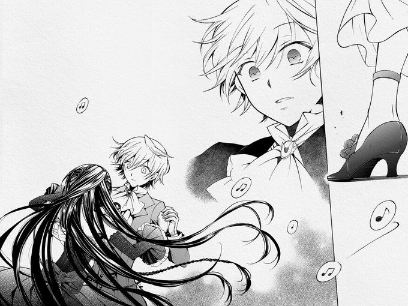
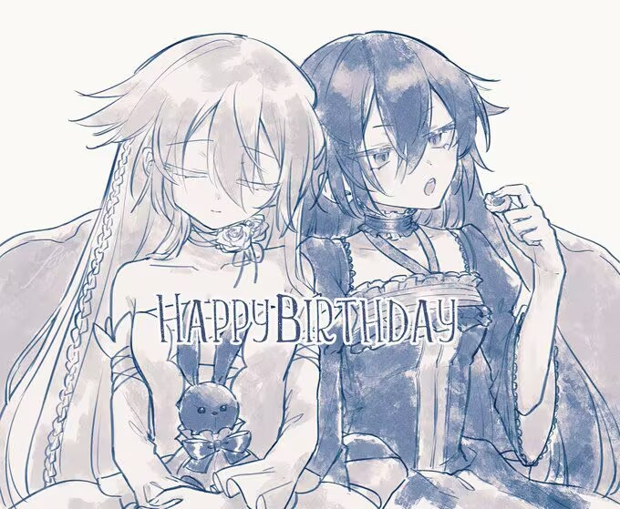
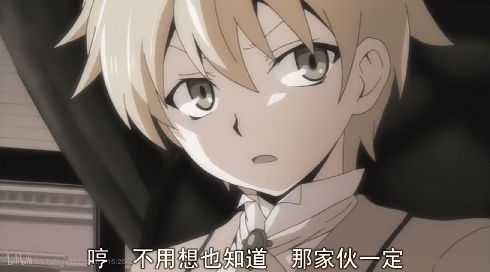
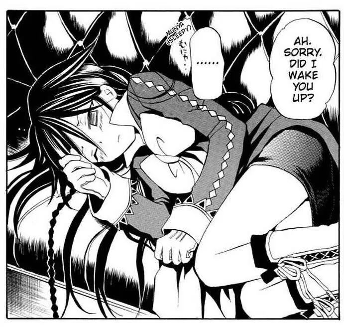

## 👋 Hello, nice to meet you~

  

---

### 🎨 Creative Side
> **"解放思想，实事求是，与时俱进。"**

- 🏛️ **Major:** Digital Media Arts @ **BUU** (Freshman) / 数字媒体艺术专业（大一）
- 📍 **Hometown:** Wuhan ➡️ Beijing / 湖北武汉 ➡️ 北京
- 🧬 **Philosophy:** Exploring the world through the lens of **Computer Science & Design**. 
- 🩵 **About:** Aria/小唉 · Born in 2007 · 19yo · Self-learning Frontend.

### 💻 Technical Journey
- 🛠️ **Focus:** `Next.js`, `React`, `Vue`
- 🤝 **Mission:** Mastering Frontend Engineering & Community Collaboration.

---

## 🕊️ My Spirit Guardian: Pandora Hearts

  
  
<i>"I want to become someone who is gentle yet powerful, just like Oz Sama."</i>

 

<table align="center" style="border-collapse: collapse; border: none; border-spacing: 0; padding: 0;">
  <tr style="border: none;">
    <td align="center" valign="middle" style="border: none; padding: 0;">
      
    </td>
    <td align="center" valign="middle" style="border: none; padding: 0;">
      
    </td>
    <td align="center" valign="middle" style="border: none; padding: 0;">
      
    </td>
  </tr>
</table>

---

### 🛠️ Focus & Learning

  

   
  <b>Vistors count / 信号接收次数:</b>
  

